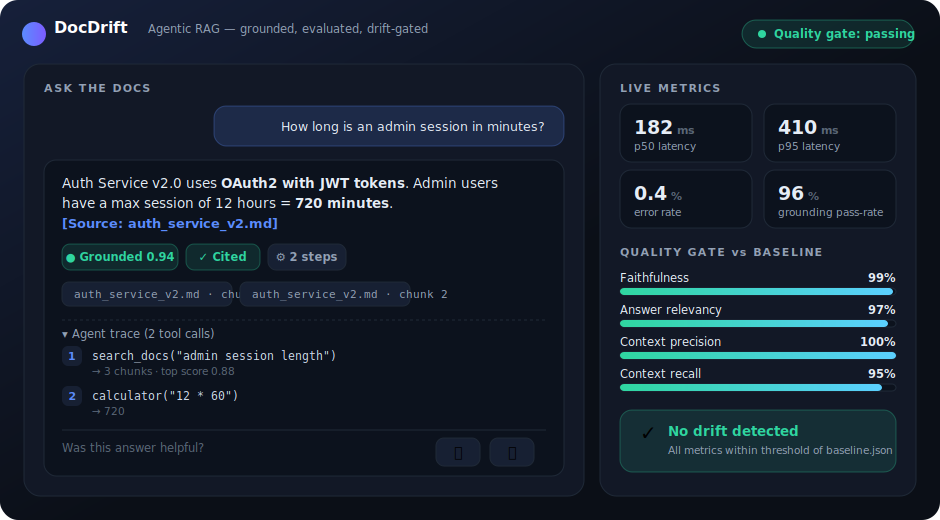
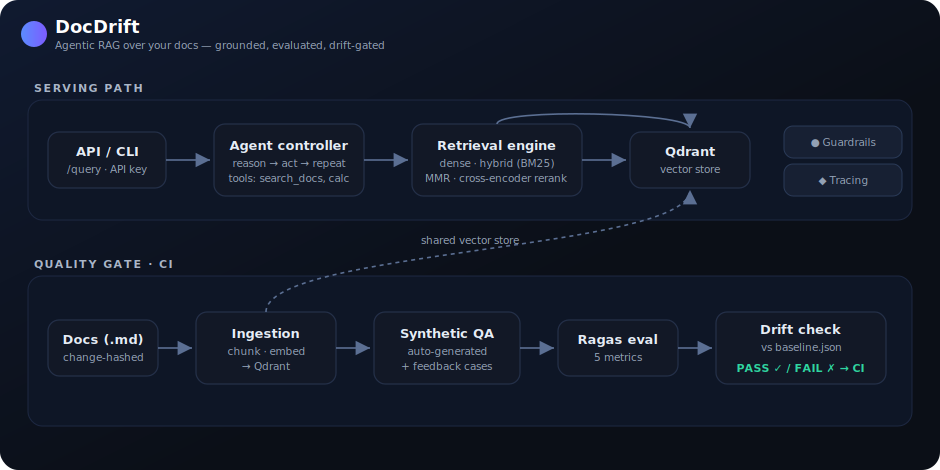

<div align="center">

# DocDrift

### Agentic RAG over your documentation — grounded, evaluated, and drift-gated.


</div>

DocDrift answers questions about your docs using an agentic RAG service — and,
more importantly, it **knows when it has gotten worse**. It auto-generates a test
set, scores every answer with Ragas, and **fails the build when a doc, prompt, or
config change causes a measurable quality regression** ("documentation drift").

<div align="center">



</div>

## Highlights

- **Agentic RAG** — the LLM drives a loop and calls retrieval, search, and a
  calculator as tools; it can re-query and multi-hop instead of a one-shot pipe.
- **Answer guardrails** — every answer gets a grounding score + citation check, so
  hallucinated or unsourced answers are flagged, not shipped.
- **Drift gate in CI** — synthetic QA + Ragas metrics compared to a committed
  baseline; a regression fails the build.
- **Production serving** — FastAPI service, config validation, retries/backoff,
  embedding & retrieval caching, and per-request tracing (p50/p95, error rate).
- **Strong retrieval** — dense search + BM25 hybrid + MMR + a **cross-encoder
  reranker** (`BAAI/bge-reranker-base`).
- **Human feedback flywheel** — thumbs-down answers become regression test cases
  that the drift gate must keep passing.
- **Runs anywhere** — embedded on-disk Qdrant by default (no server/cloud needed).

## Demo

An interactive, no-backend demo lives in [`demo/index.html`](demo/index.html) —
open it in a browser to click through sample questions, grounding badges,
citations, the agent trace, and the live metrics panel (great for a screen
recording). The image above is rendered from it.

To run it live against the real stack, start the API (below) and point a UI at
`/query` and `/metrics`.

## Architecture

Two halves work together: a **serving path** that answers questions, and a
**quality gate** that continuously proves those answers are good.



```
src/
├── core/          # config + validation, retry/backoff, caching, logging
├── ingestion/     # markdown chunking, embedding, Qdrant vector store
├── retrieval/     # dense search + MMR, hybrid (BM25), cross-encoder rerank
├── agentic/       # agent loop, whitelisted tools, answer guardrails
├── evaluation/    # synthetic QA, Ragas metrics, drift gate, feedback
├── observability/ # per-request tracing + aggregate stats
├── automation/    # change detection → auto re-ingest → re-eval
└── api/           # FastAPI: /health /query /ingest /metrics /feedback
```

## Quick start

```bash
pip install -r requirements.txt
cp .env.example .env
python -m src.ingestion.cli --all          # ingest the docs
python -m src.agentic.cli "What auth method does v2 use?"
```

### Vector store modes

Chosen by env var — no code change:

| Mode | How | When |
|------|-----|------|
| **Embedded on-disk** (default) | leave `QDRANT_URL` empty | local dev / demos — **no server or cloud** |
| **In-memory** | `QDRANT_PATH=:memory:` | quick tests (not persisted) |
| **Remote / Cloud** | set `QDRANT_URL` (+ `QDRANT_API_KEY`) | production / shared deploys |

Embedded mode requires nothing running. You still need **Ollama** for embeddings
and the LLM (`ollama pull llama3.2:3b nomic-embed-text`).

## Run as a service

```bash
uvicorn src.api.app:app --reload --port 8000          # local
# or the full stack:
docker compose up -d                                  # api + qdrant + ollama
```

```bash
curl -X POST localhost:8000/query \
  -H 'Content-Type: application/json' \
  -d '{"question": "How long is an admin session in minutes?"}'
```

Every `/query` returns the answer plus a **guardrail verdict** (grounded? cited?
grounding score) and is recorded as a trace. `/metrics` aggregates p50/p95
latency, error rate, tool usage, and cache hit-rates.

## Evaluate quality & detect drift

```bash
python pipeline.py                      # synthetic QA → Ragas → fail on drift
python pipeline.py --set-baseline       # record current scores as the baseline
python pipeline.py --compare-agentic    # naive vs. agentic RAG, same questions
python pipeline.py --compare-retrievers # top_k / MMR / hybrid side by side
```

The same evaluation runs in CI on every push that touches docs, code, or config.
If faithfulness drops below threshold or any metric regresses past the baseline,
the build fails — so drift is caught before it ships.

## Continuous re-ingestion

Drift detection shouldn't wait for a human. The automation layer detects which
docs changed (by content hash), re-ingests only those, re-runs the evaluation,
and reports drift:

```bash
python -m src.automation.cli --once     # cron/CI; exit 1 on drift, 2 on failure
python -m src.automation.cli --watch    # local file watcher
```

A daily scheduled run ships in `.github/workflows/scheduled-reingest.yml`.

## Feedback flywheel

Real failures are the most valuable test cases. A thumbs-down on `/feedback`
promotes that question into a regression set; if the user supplies a correction
it becomes a gold reference answer. Fold them into the gate so a fixed failure
stays fixed:

```bash
python pipeline.py --include-regressions
```

## Agentic vs. naive RAG

Naive RAG retrieves once and answers. The agentic controller lets the LLM decide
*what to do next* — search again with a refined query, run a calculator, or
combine multiple rounds before answering.

| | Naive RAG | Agentic RAG |
|--|-----------|-------------|
| Flow | retrieve once → answer | LLM decides each step |
| Multi-hop | can't re-search | re-queries with refined terms |
| Tools | none | `search_docs`, `calculator`, … |
| Control | fixed pipeline | the LLM is the controller |

## Production engineering

| Capability | Why it matters |
|------------|----------------|
| **REST API** | Lets other systems use DocDrift, not just a human at a terminal |
| **Config validation** | Fails fast on a bad `config.yaml` instead of silent wrong defaults |
| **Retry / backoff** | Transient Ollama/Qdrant blips retry instead of failing the request |
| **Caching** | Deterministic embeddings + repeat queries served from memory |
| **Tracing** | Debug any answer; alert on p95 latency / error rate |
| **Guardrails** | Flags ungrounded or uncited answers instead of shipping hallucinations |
| **Cross-encoder reranker** | Production-grade retrieval accuracy over bi-encoder similarity |
| **Drift gate** | CI blocks quality regressions from doc or prompt changes |
| **Feedback flywheel** | Real-world failures become permanent regression tests |

## Tech stack

Python · FastAPI · Qdrant · Ollama (local LLM + embeddings) · Ragas · BM25 ·
sentence-transformers · Pydantic · pytest · GitHub Actions · Docker Compose.

## Roadmap

Source connectors (Confluence/Notion), prompt & model A/B evaluation, streaming
responses with conversation memory, and per-request token/cost accounting.
