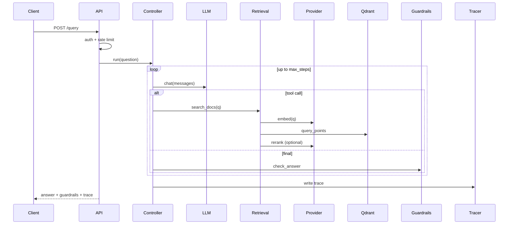

# DocDrift — System Design

## 1. Problem & goals
Serve grounded, cited answers from a document corpus **and** continuously prove
those answers don't silently degrade when docs/prompts/config change.

**Goals:** grounded answers with citations; catch quality regressions (drift) in
CI; run locally with zero infra and in the cloud without a GPU; be observable.
**Non-goals:** training/fine-tuning models; a general chat product; real-time
collaborative editing.

## 2. Two planes
DocDrift is two cooperating planes over shared storage.

```
                ┌──────────────── SERVING PLANE (online) ───────────────┐
 client ─▶ FastAPI ─▶ AgenticController ─▶ RetrievalEngine ─▶ Qdrant
            │  auth, rate-limit, CORS   │  tools(search,calc)  │ dense+hybrid+MMR+rerank
            │                           ▼                      ▼
            │                       Guardrails             LLM/Embeddings provider
            ▼                       + Tracer                 (Ollama | OpenAI-compat | ST)
        /metrics /feedback /sources /query[/stream]
                └───────────────────────────────────────────────────────┘

                ┌──────────────── QUALITY PLANE (offline/CI) ───────────┐
 docs ─▶ Ingestion (chunk→embed→upsert) ─▶ Qdrant
                                     └▶ Synthetic QA + regression cases ─▶ Ragas ─▶ Drift gate ─▶ pass/fail
                automation: change-detect (hash) → re-ingest → re-eval
                └───────────────────────────────────────────────────────┘
```

## 3. Components & responsibilities
| Component | Module | Responsibility |
|---|---|---|
| API | `src/api/` | HTTP surface, auth, CORS, rate limit, request/response schemas |
| Controller | `agentic/controller.py` | agent loop (`_iter`), tool dispatch, run/stream |
| Tools | `agentic/tools.py` | whitelisted `search_docs`, `calculator` |
| Guardrails | `agentic/guardrails.py` | grounding score + citation verdict |
| Retrieval | `retrieval/` | dense + hybrid(BM25) + MMR + rerank + multi-query |
| Vector store | `ingestion/vectorstore.py` | Qdrant client, upsert, ingest-state, `list_documents` |
| Ingestion | `ingestion/` | chunk → embed → upsert; skip-by-hash |
| Provider | `core/llm.py` | `chat()`/`embed()` across Ollama/OpenAI-compat/ST |
| Eval | `evaluation/` | synthetic QA, Ragas, drift gate, feedback store |
| Automation | `automation/` | change detection → re-ingest → re-eval |
| Observability | `observability/` | per-request JSONL trace + aggregate stats |
| Core | `core/` | config+schema, cache, retry, logging, identity |

## 4. Key interfaces (API contract)
- `GET /health` → `{status, checks{config,qdrant}}` (no auth).
- `POST /query {question}` → `{answer, steps, tools_used, tool_calls, retrieved_contexts, guardrails, warning}`.
- `POST /query/stream` → SSE events `step` → `token` → `done`.
- `POST /ingest` → `{ingested_chunks}`.
- `GET /metrics` → `{traces, embedding_cache, retrieval_cache}`.
- `POST /feedback {question,answer,rating,correct_answer?}` → `{id,rating,promoted_to_regression}`.
- `GET /sources` → `{documents[]}` (from Qdrant).
Auth: `X-API-Key` on all but `/health` when `DOCDRIFT_API_KEY` set. Rate limit: per-IP fixed window.

## 5. Data model
- **Qdrant point:** `{id: uuid, vector: float[dim], payload:{text, doc_id, chunk_index, version, source, ingested_at}}`.
- **ingest_state.json:** `{doc_id: content_hash}` — skip-unchanged.
- **traces.jsonl:** one JSON/line `{trace_id, operation, ts, latency_ms, ok, steps, tools_used, grounded, grounding_score}`.
- **feedback / regression:** JSONL or Postgres (`feedback`, `regression_cases(question PK, reference, source, trace_id, created_at)`).
- **baseline.json:** `{created_at, scores{metric: float}}` (committed for CI).

## 6. Query sequence


## 7. Config & providers
Single `config/config.yaml` validated by `core/schema.py`. Provider chosen by
`models.provider` (chat) and `models.embed_provider` (embeddings), overridable by
`LLM_PROVIDER`/`EMBED_PROVIDER` env. Vector store mode from `QDRANT_URL`/`QDRANT_PATH`.

## 8. Failure modes & mitigations
| Failure | Current | Mitigation / gap |
|---|---|---|
| Qdrant/Ollama transient error | `@retry` backoff | ✅ |
| Bad config | Pydantic fail-fast | ✅ |
| Embedding-dim mismatch | auto-recreate collection | ✅ |
| Empty/stale collection | ungrounded answers | ⚠️ orphan GC + empty-state UX (issue) |
| Open endpoint abuse | per-IP rate limit | ⚠️ in-memory, per-process, unbounded dict (issue) |
| Prompt injection via docs | none | ⚠️ (issue) |
| Destructive-command answers | none | ⚠️ tripwire (issue) |
| traces/feedback JSONL growth | none | ⚠️ rotation/DB (issue) |
| Long/blocking `/ingest`, LLM hang | sync, no timeout | ⚠️ job queue + timeouts (issue) |

## 9. Scaling
- **API is stateless** → scale horizontally behind a load balancer. Blockers to
  fix first: rate limiter and caches are in-process → move to **Redis**; feedback
  already supports **Postgres**, move traces there too.
- **Vector store:** embedded is single-process (dev only); use a Qdrant **server**
  in prod; shard/replicate the collection as it grows.
- **Model:** dedicated inference (vLLM/TGI) or a hosted API; cache embeddings +
  add a semantic cache to cut cost/latency.

## 10. Security
API-key auth + per-IP rate limit; secrets via env, never committed. Open gaps:
prompt-injection defense, destructive-answer tripwire, constant-time key compare,
and not passing keys via URL query (they leak into access logs).

## 11. Observability & SLOs (proposed)
Trace every request; expose p50/p95 latency, error rate, grounding pass-rate,
cache hit-rate. Suggested SLOs: p95 < 3s (hosted model), grounding pass-rate > 90%,
error rate < 1%. Alert on drift-gate failures and grounding-rate drops.

## 12. Deployment topology
- **Local:** embedded Qdrant + Ollama; `uvicorn`.
- **Cloud:** frontend (Vercel static) → API (HF Space / Render, Docker) → Qdrant
  Cloud + hosted model (HF router/OpenAI/Groq) for chat, local sentence-transformers
  for embeddings. CI runs unit tests + drift-gated eval; a scheduled job re-ingests.
```

## 13. Top risks
1. Rate limiter is in-process/unbounded → not safe at scale (memory + multi-instance).
2. No corpus hygiene (orphans/contradictions) → the exact "poisoned answer" failure.
3. Unbounded JSONL logs → disk pressure over time.
4. No prompt-injection / destructive-answer defense on a public endpoint.
